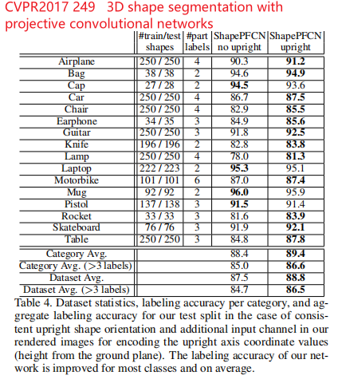
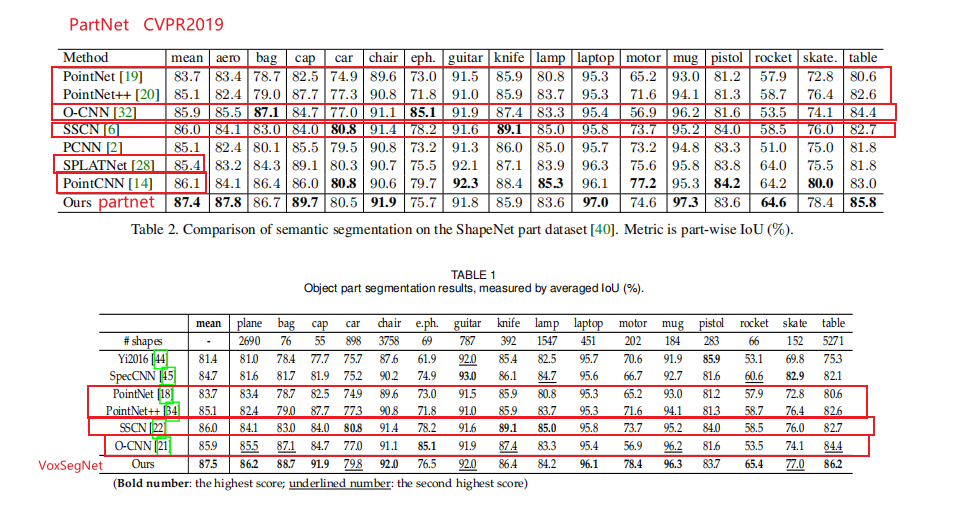
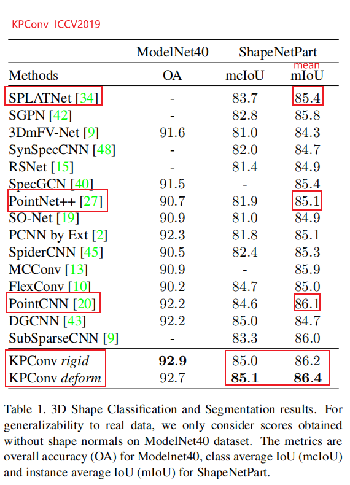
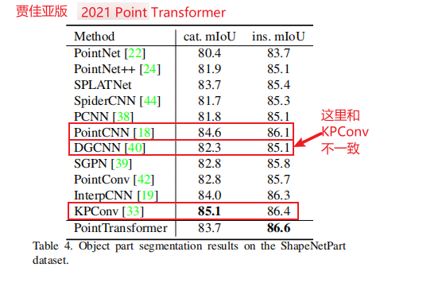
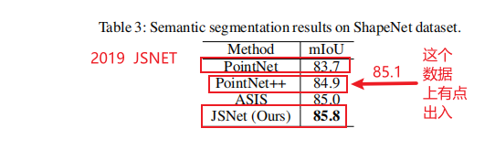
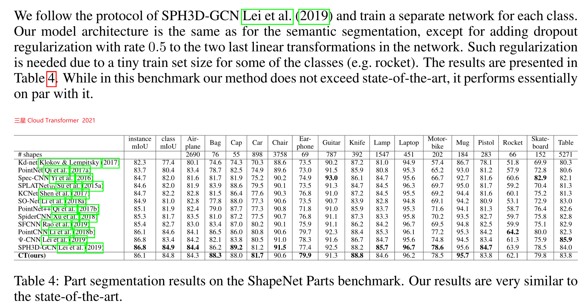
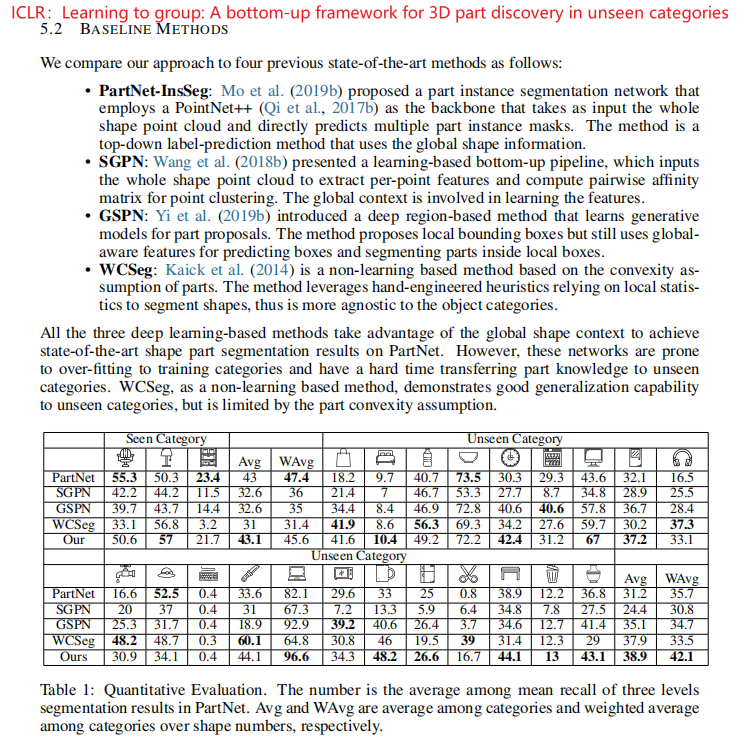

# 1、Part Segmentation

​		The difficulties for part segmentation of 3D shapes are twofold. First, shape parts with the same semantic label have a large geometric variation and ambiguity. Second, the number of parts in objects with the same semantic meanings may be different. VoxSegNet [248] is proposed to achieve fine-grained part segmentation on 3D voxelized data under a limited solution. 

​		A Spatial Dense Extraction (SDE) module (which consists of stacked atrous residual blocks) is proposed to extract multiscale discriminative features from sparse volumetric data. The learned features are further re-weighted and fused by progressively applying an Attention Feature Aggregation (AFA) module. Kalogerakis et al. [249] combined FCNs and surface-based CRFs to achieve end-to-end 3D part segmentation. They first generated images from multiple views to achieve optimal surface coverage and fed these images into a 2D network to produce confidence maps. Then, these con- fidence maps are aggregated by a surface-based CRF, which is responsible for a consistent labeling of the entire scene. Yi et al. [250] introduced a Synchronized Spectral CNN (SyncSpecCNN) to perform convolution on irregular and non-isomorphic shape graphs. A spectral parameterization of dilated convolutional kernels and a spectral transformer network is introduced to solve the problem of multi-scale analysis in parts and information sharing across shapes. 

​		Wang et al. [251] first performed shape segmentation on 3D meshes by introducing Shape Fully Convolutional Networks (SFCN) and taking three low-level geometric features as its input. They then utilized voting-based multilabel graph cuts to further refine the segmentation results. Zhu et al. [252] proposed a weakly-supervised CoSegNet for 3D shape co-egmentation. This network takes a collection of unsegmented 3D point cloud shapes as input, and produces shape part labels by iteratively minimizing a group consistency loss. Similar to CRF, a pre-trained partrefinement network is proposed to further refine and denoise part proposals. Chen et al. [253] proposed a Branched AutoEncoder network (BAE-NET) for unsupervised, oneshot and weakly supervised 3D shape co-segmentation. This method formulates the shape co-segmentation task as a representation learning problem and aims at findingthe simplest part representations by minimizing the shape reconstruction loss. Based on the encoder-decoder architecture, each branch of this network can learn a compact representation for a specific part shape. The features learned from each branch and the point coordinate are then fed to the decoder to produce a binary value (which indicates whether the point belongs to this part). This method has good generalization ability and can process large 3D shape collections (up to 5000+ shapes). However, it is sensitive to initial parameters and does not incorporate shape semantics into the network, which hinders this method to obtain a robust and stable estimation in each iteration. Yu et al. [254] proposed a top-down recursive part decomposition network (PartNet) for hierarchical shape segmentation. Different from existing methods that segment a shape to a fixed label set, this network formulates part segmentation as a problem of cascade binary labeling, and decompose the input point cloud to an arbitrary number of parts based on the geometric structure. Luo et al. [255] introduced a learning-based grouping framework for the task of zeroshot 3D part segmentation. To improve the cross-category generalization ability, this method tends to learn a grouping policy that restricts the network to learn part-level features within the part local context.

​		**VoxSegNet[248]**的提出是为了在有限的解决方案下实现对3D体素数据的细粒度分割。为了从稀疏体数据中提取多尺度区分特征，提出了一种空间密集提取模块(SDE)。通过逐步应用注意力特征聚集(AFA)模块，进一步对学习的特征进行重新加权和融合。**Kalogerakis等人。[249]**将FCN和基于曲面的CRF相结合，实现端到端的3D零件分割。他们首先从多个视图生成图像，以实现最优的表面覆盖，然后将这些图像馈送到2D网络中，以生成置信度图。然后，这些置信度图由基于曲面的CRF聚合，该CRF负责对整个场景进行一致的标记。**Yi等人的研究成果。[250]**介绍了一种同步谱CNN(SyncSpecCNN)，用于对不规则、非同构的形状图进行卷积。引入膨胀卷积核的谱参数化和谱变换网络，解决了局部多尺度分析和形状间信息共享的问题。

​		**Wang等人。[251]**首先引入形状完全卷积网络(SFCN)，以3个低层几何特征作为输入，对三维网格进行形状分割。然后，他们利用基于投票的多标签图切割来进一步细化分割结果。**朱等人。[252]**提出了一种用于三维形状共分割的弱监督CoSegNet算法。该网络将未分割的3D点云形状集合作为输入，通过迭代最小化组一致性损失来产生形状部分标签。类似于CRF，提出了一个预先训练的配对网络来进一步提炼和去噪部分建议。**Chen等人。[253]**提出了一种分支自动编码器网络(BAE-Net)，用于无监督、单镜头和弱监督3D形状的联合分割。该方法将形状共分割问题描述为一个表示学习问题，目的是通过最小化形状重构损失来寻找最简单的零件表示。基于编解码器体系结构，该网络的每个分支都可以学习特定零件形状的紧凑表示。然后，从每个分支学习的特征和点坐标被馈送到解码器以产生二进制值(其指示点是否属于该部分)。该方法具有较好的泛化能力，可以处理大的三维形状集合(多达5000多个形状)。但是，该方法对初始参数敏感，没有将形状语义引入网络，阻碍了该方法在每次迭代中获得稳健稳定的估计。**余等人。[254]**提出了一种自上而下的递归零件分解网络(PARTNET)进行层次形状分割。不同于现有的将形状分割为固定标签集的方法，该网络将零件分割问题描述为级联二进制标注问题，并根据几何结构将输入点云分解为任意数量的零件。**Luo等人。[255]针对**零镜头三维零件分割任务，提出了一种基于学习的分组框架。为了提高跨类别的泛化能力，该方法倾向于学习一种分组策略，该分组策略限制网络在局部上下文中学习零件级特征。

[248] Z. Wang and F. Lu, “VoxSegNet: Volumetric CNNs for semantic part segmentation of 3D shapes,” IEEE **TVCG, 2019**.
[249] E. Kalogerakis, M. Averkiou, S. Maji, and S. Chaudhuri, “3D shape segmentation with projective convolutional networks,” in **CVPR, 2017.**
[250] L. Yi, H. Su, X. Guo, and L. J. Guibas, “SyncSpecCNN: Synchro-nized spectral CNN for 3D shape segmentation,” in **CVPR, 2017.**
[251] P . Wang, Y . Gan, P . Shui, F. Yu, Y . Zhang, S. Chen, and Z. Sun, “3D shape segmentation via shape fully convolutional networks,” **Computers & Graphics, 2018.**
[252] C. Zhu, K. Xu, S. Chaudhuri, L. Yi, L. Guibas, and H. Zhang, “CoSegNet: Deep co-segmentation of 3D shapes with group consistency loss,” arXiv preprint arXiv:1903.10297, **2019.**
[253] Z. Chen, K. Yin, M. Fisher, S. Chaudhuri, and H. Zhang, “BAE-NET: Branched autoencoder for shape co-segmentation,” in **ICCV, 2019.**
[254] F. Yu, K. Liu, Y . Zhang, C. Zhu, and K. Xu, “PartNet: A recursive part decomposition network for fine-grained and hierarchical shape segmentation,” in **CVPR, 2019.**
[255] T. Luo, K. Mo, Z. Huang, J. Xu, S. Hu, L. Wang, and H. Su, “Learning to group: A bottom-up framework for 3D part discovery in unseen categories,” in **ICLR, 2020.**

# 2、当前的一些结果

数据集：shapenet part dataset 与 partnet dataset

## 2.1、shapenet part dataset

> 介绍：
>
> 

## 2.2、partnet(FineSeg) dataset

> 介绍：
>
>  K. Mo, S. Zhu, A. X. Chang, L. Yi, S. Tripathi, L. J. Guibas,and H. Su. Partnet: A large-scale benchmark for fifine-grained
>
> and hierarchical part-level 3d object understanding. *arXiv.* preprint arXiv:1812.02713*, 2018. 4
>
> 提出了FineSeg。该数据集包含了大约3000个3D形状，超过六个形状类别：椅子（1000)，桌子(500)，飞机(600)，沙发(600)，直升机(100)和自行车(140）。这些模型是从**Sung等人的工作[29]**中使用的**ShapeNet[3]**的一个子集中收集出来的；对于那些分割不够细粒度的模型（例如，没有实例部件分割），我们手动对模型进行分割。然后，我们使用在**[36]**中提出的方法，为每个形状构建一个零件层次结构。

