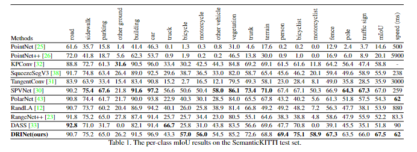
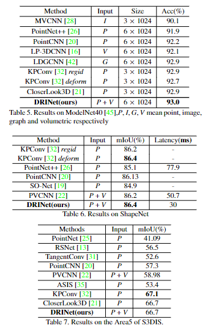

## 2021

### ICCV

1、[[ICCV](https://arxiv.org/abs/2108.04023)] DRINet: A Dual-Representation Iterative Learning Network for Point Cloud Segmentation. [__`Segmentation`__] [no code]

> **Title:** DRINet：用于点云分割的双重表示迭代学习网络
>
> **Abstract**
>
> 问题：1、如何找到合适的方法表示点云数据结构来保持其自身的内部物理属性（排列不变性和尺度不变性）？
>
> 解决：提出了双重表示迭代学习点云分割。
>
> 优势：在特征转移方面具有很好的灵活性；对于大规模点云计算成本低；
>
> 核心模块：
>
>  `DRINet 将特征学习过程解耦为 SPVFE 和 SVPFE。`
>
> - Sparse Point-Voxel Feature Ex-traction   稀疏的 点-体素提取   `在 SPVFE 中，DRINet 通过新颖的多尺度池化层生成更好的逐点特征，该层可以聚合不同尺度的特征。`
>
> - Sparse Voxel-Point Feature Extraction    稀疏的 体素-点提取  `在 SVPFE 中，当放弃引入巨大内存占用的双线性收集操作时，提出了注意力收集来处理特征退化。`
>
>   `通过迭代使用这两个模块，在两种不同的表示之间传播特征。`
>
> - 提出逐点局部学习新型多尺度池化层来改善上下文信息的传播
>
> 成就：
>
> ​	大规模户外场景上得到62ms/帧，点云分类和分割上效果最优。
>
> 数据集：
>
> - 户外语义分割：SemanticKITTI场景分割 
> - 户内任务：ModelNet40分类、ShapeNet Part部件分割、S3DIS场景分割。

2、[[ICCV](https://arxiv.org/abs/2107.11769)] ReDAL: Region-based and Diversity-aware Active Learning for Point Cloud Semantic Segmentation. [__`Segmentation`__]

3、[[ICCV](https://arxiv.org/abs/2107.14230)] Learning with Noisy Labels for Robust Point Cloud Segmentation. [[code](https://shuquanye.com/PNAL_website/)][__`Segmentation`__]

4、[[ICCV](https://arxiv.org/abs/2108.07478)] Instance Segmentation in 3D Scenes using Semantic Superpoint Tree Networks. [[code](https://github.com/Gorilla-Lab-SCUT/SSTNet)][__`Segmentation`__]

5、[[ICCV](https://arxiv.org/abs/2108.02350)] Hierarchical Aggregation for 3D Instance Segmentation. [[code](https://github.com/hustvl/HAIS)][__`Segmentation`__]

6、[[ICCV](https://arxiv.org/abs/2012.09164)] Point Transformer. [__`Transformer`__]

7、[[ICCV](https://openaccess.thecvf.com/content/ICCV2021/papers/Zhou_TempNet_Online_Semantic_Segmentation_on_Large-Scale_Point_Cloud_Series_ICCV_2021_paper.pdf)] TempNet: Online Semantic Segmentation on Large-scale Point Cloud Series. [__`Segmentation`__]

8、[[ICCV](https://openaccess.thecvf.com/content/ICCV2021/papers/Zhang_Perturbed_Self-Distillation_Weakly_Supervised_Large-Scale_Point_Cloud_Semantic_Segmentation_ICCV_2021_paper.pdf)] Perturbed Self-Distillation: Weakly Supervised Large-Scale Point Cloud Semantic Segmentation. [__`Segmentation`__]

9、[[ICCV](https://openaccess.thecvf.com/content/ICCV2021/papers/Jiang_Guided_Point_Contrastive_Learning_for_Semi-Supervised_Point_Cloud_Semantic_Segmentation_ICCV_2021_paper.pdf)] Guided Point Contrastive Learning for Semi-Supervised Point Cloud Semantic Segmentation. [__`Segmentation`__]

10、[[ICCV](https://openaccess.thecvf.com/content/ICCV2021/papers/Hui_Superpoint_Network_for_Point_Cloud_Oversegmentation_ICCV_2021_paper.pdf)] Superpoint Network for Point Cloud Oversegmentation.[[code](https://github.com/fpthink/SPNet)] [__`Segmentation`__]

