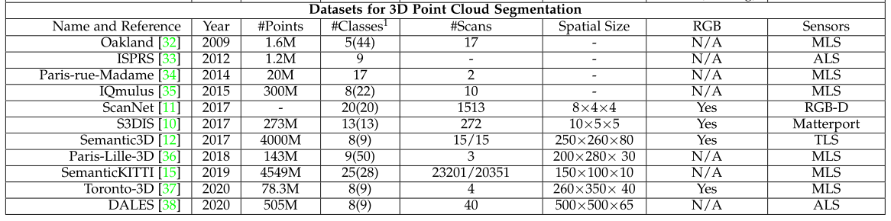
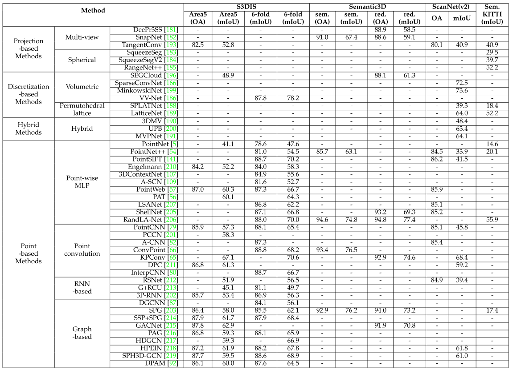

# 常用Benchmark DataSet

## 1、Public Datasets

- ScanNet (CVPR'17) [[paper]](https://arxiv.org/pdf/1702.04405) [[data]](https://github.com/ScanNet/ScanNet) [[project page]](http://www.scan-net.org/) [[results]](http://kaldir.vc.in.tum.de/scannet_benchmark/)  
- S3DIS (CVPR'17) [[paper]](http://buildingparser.stanford.edu/images/3D_Semantic_Parsing.pdf) [[data]](https://docs.google.com/forms/d/e/1FAIpQLScDimvNMCGhy_rmBA2gHfDu3naktRm6A8BPwAWWDv-Uhm6Shw/viewform?c=0&w=1) [[project page]](http://buildingparser.stanford.edu/dataset.html#Download)
- Semantic3D (ISPRS'17) [[paper]](https://www.ethz.ch/content/dam/ethz/special-interest/baug/igp/photogrammetry-remote-sensing-dam/documents/pdf/Papers/Hackel-etal-cmrt2017.pdf) [[project page]](http://www.semantic3d.net/)
  - _semantic-8_ [[data]](http://www.semantic3d.net/view_dbase.php?chl=1#download) [[results]](http://www.semantic3d.net/view_results.php?chl=1)
  - _reduced-8_ [[data]](http://www.semantic3d.net/view_dbase.php?chl=2#download) [[results]](http://www.semantic3d.net/view_results.php?chl=2)
- Paris-Lille-3D (IJRR'18) [[paper]](https://arxiv.org/pdf/1712.00032) [[data]](https://cloud.mines-paristech.fr/index.php/s/JhIxgyt0ALgRZ1O) [[project page]](http://npm3d.fr/) [[results]](http://npm3d.fr/paris-lille-3d) 
- SemanticKITTI (ICCV'19) [[paper]](https://arxiv.org/pdf/1904.01416) [[data]](http://semantic-kitti.org/dataset.html#download) [[project page]](http://semantic-kitti.org/index.html) [[results]](https://competitions.codalab.org/competitions/20331#results)
- Toronto-3D(CVPRW2020)[[paper]](https://github.com/lizhangjie316/3D-Point-Cloud-Semantic-Segement-Paper/blob/master/Dataset-Paper/Tan_Toronto-3D_A_Large-Scale_Mobile_LiDAR_Dataset_for_Semantic_Segmentation_of_CVPRW_2020_paper.pdf) [[data]](https://1drv.ms/u/s!Amlc6yZnF87psX6hKS8VOQllVvj4?e=yWhrYX) [[project page]](https://github.com/WeikaiTan/Toronto-3D)[[无results]](#)
- DALES(CVPRW2020)[[paper]](https://github.com/lizhangjie316/3D-Point-Cloud-Semantic-Segement-Paper/blob/master/Dataset-Paper/Varney_DALES_A_Large-Scale_Aerial_LiDAR_Data_Set_for_Semantic_Segmentation_CVPRW_2020_paper.pdf) [[data]](https://docs.google.com/forms/d/e/1FAIpQLSe3IaTxCS7wKH01SHn_o7U86ToIw9K26vc0bkwiELn6wwh8gg/viewform) [[project page]](https://udayton.edu/engineering/research/centers/vision_lab/research/was_data_analysis_and_processing/dale.php) [[无results]](#)

对于3D点云分割，这些数据集由不同类型的传感器获取，包括移动激光扫描仪(MLS)[15]、[34]、[36]、空中激光扫描仪(ALS)[33]、[38]、静态陆地激光扫描仪(TLS)[12]、RGBD相机[11]和其他3D扫描仪[10]。这些数据集可用于开发各种挑战的算法，包括相似干扰、形状不完整和类别不平衡。

## 2、Benchmark Results

