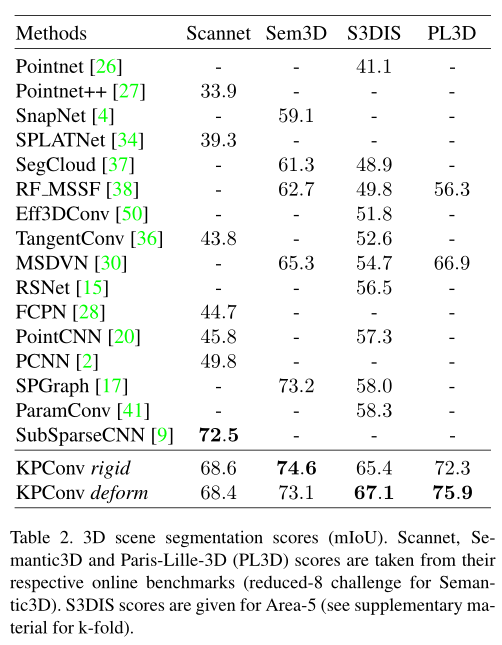
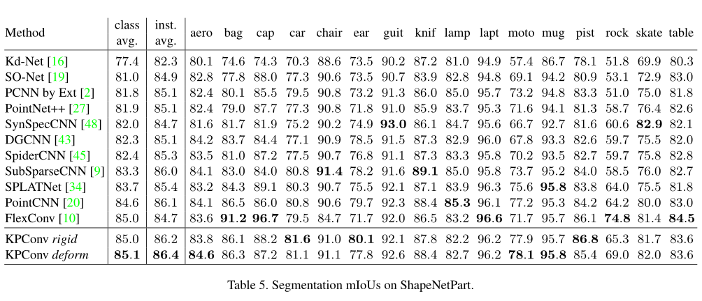
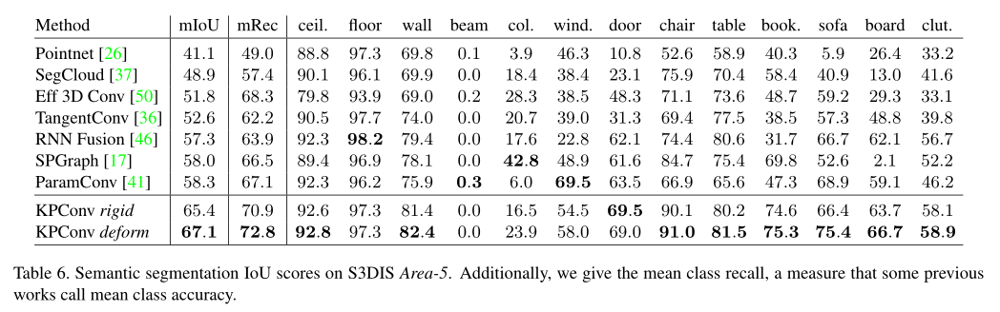
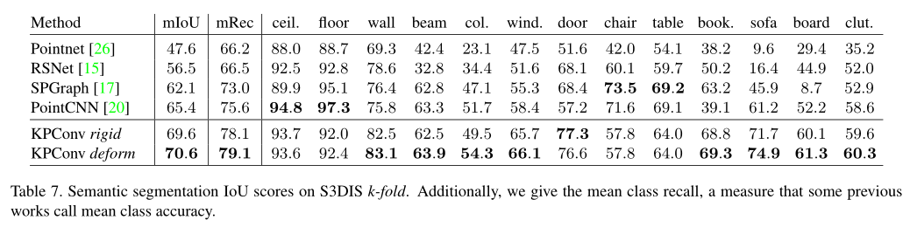

# 题目：KPConv: Flexible and Deformable Convolution for Point Clouds

## Tag

【点卷积】【可变形卷积】【点云分类】【点云分割】【核点】

## 贡献

- 提出了KPConv核点卷积，比固定网格卷积具有更大的灵活性。
- 并在核点上引入deformable convolutions
  - rigid convolutions
  - deformable convolutions

## 作者想法

- 直接对点

# 1. 背景

# 2. 特点

- 

- 

- 

## 2.1

## 2.2

## 2.3

# 3. 实验

## 3.1 ModelNet40  for classification

## 3.2 ShapenetPart for part segmentation

## 3.3 3D Scene Segmentation

### 3.3.1 数据集：Scannet、S3DIS、Semantic3D、Paris-Lille-3D

### 3.3.2 结果对比(mIOU)

rigid KPConv在Scannet与Semantic3D中表现比deformable KPConv好，分析原因是因为Semantic3D缺乏多样性，类别较少。即表明deformable KPConv在多样性上作用更明显。

### 

## 3.4 消融实验

- rigid KPConv
- deformable KPConv

# 4. 代码分析(pytorch版)
> 代码来源： 

## 4.1 model

## 4.2 预处理

## 4.3 训练

## 4.4 可视化

## 4.5 tips

# 5. 我的想法

- 是否可以不使用核点，直接对input点做变形，来聚合特征。
- 
- 
- 
- 

---

# 参考

1. [Project page]( https:// github.com/ HuguesTHOMAS/ KPConv) from github.
2. 
3. 
4. 
5. 