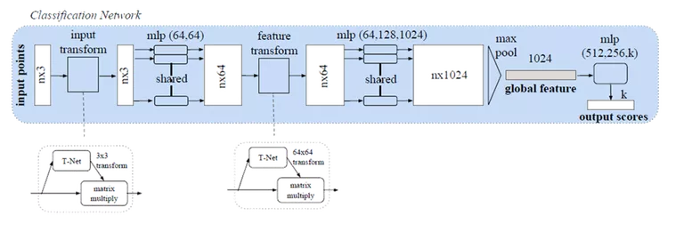
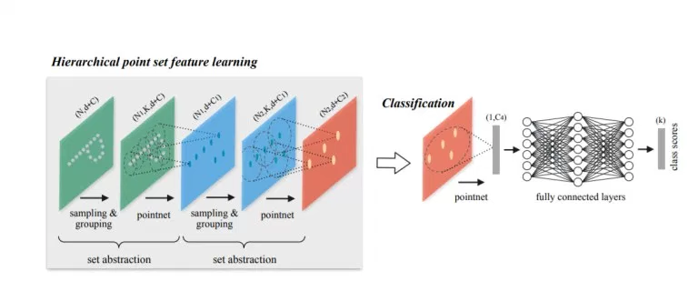

# 3D目标分类任务

对于目标分类任务，输出为k个分数，分别对应k个可能的类别。

# 3D点云场景分割

输出n*m个分数，分别对应n个点相对于m个类别的分数。

PointNet（CVPR2017）

开拓者！ 来自斯坦福大学，他们的工作引起了很多关注。他们做了一些令人惊讶的简单的事情，并证明了为什么它运作良好，他们分别在每个点上训练了一个MLP（在点之间分享权重）。每个点被“投影”到一个1024维空间。然后，他们用点对称函数（max-pool）解决了点云顺序问题。这为每个点云提供了一个1 x 1024的全局特征，这些特征点被送入非线性分类器。利用他们称为T-net的“迷你网络”解决了旋转问题。它学习了点（3 x 3）和中级特征（64 x 64）上的变换矩阵。称之为“迷你”有点让人误解，因为它实际上与主网络的大小有关。另外，由于参数数量的大量增加，引入了一个损失项来约束64×64矩阵接近正交。也使用类似的网络进行零件分割。也做了场景语义分割。做得好！我强烈推荐阅读（或者您也可以观看演示视频）。本文对ModelNet40数据集的准确率高达89.2％。下图是pointNet点云分类的框架

引用: Charles R. Qi, Hao Su, Kaichun Mo, and Leonidas J. Guibas. Pointnet: Deep learning on point sets for 3d classication and segmentation. In The IEEE Conference on Computer Vision and Pattern Recognition (CVPR), July 2017.

The code is available on GitHub: [PointNet code ](https://github.com/charlesq34/pointnet)

Pointnet ++（NIPS 2017）

在PointNet之后不久，引入了Pointnet ++。它本质上是PointNet的分层版本。每个图层都有三个子阶段：采样，分组和PointNeting。在第一阶段，选择质心，在第二阶段，把他们周围的邻近点（在给定的半径内）创建多个子点云。然后他们将它们给到一个PointNet网络，并获得这些子点云的更高维表示。然后，他们重复这个过程（样本质心，找到他们的邻居和Pointnet的更高阶的表示，以获得更高维表示）。使用这些网络层中的3个。还测试了不同层级的一些不同聚合方法，以克服采样密度的差异（对于大多数传感器来说这是一个大问题，当物体接近时密集样本，远处时稀疏）。他们在原型PointNet上进行了改进，在ModelNet40上的准确率达到了90.7％。下面是Pointnet++ 架构。

 

引用: Charles R Qi, Li Yi, Hao Su, and Leonidas J Guibas. Pointnet++: Deep hierarchical feature learning on point sets in a metric space. arXiv preprint arXiv:1706.02413, 2017.